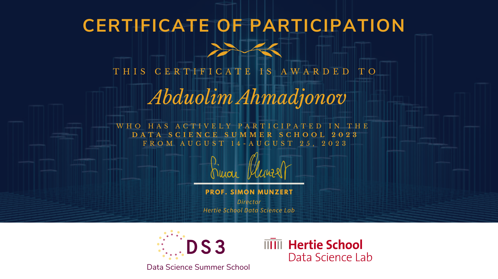

# Data-Science-Summer-School-2023

[Data Science Summer School 2023 Certificate](https://ds3-cert-2023-91b1286b1c6e.herokuapp.com/)
* Introduction to R Programming
* Introduction to Python Programming
* Calculus for Data Science
* Linear Algebra for Data Science
* Probability for Data Science
* Deep Learning for Multimodal Systems
* Transformers for Natural Language Processing
* Generative Adversarial Networks
